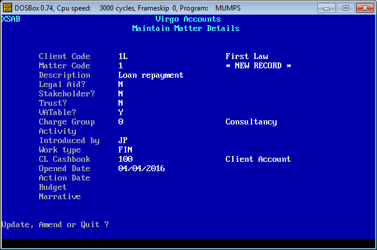

# Virgo Accounts

Virgo Accounts is a DOS-based accounting system designed for sole practitioners and very small firms of solicitors in England and Wales. It is also suitable for lawyers in other jurisdictions, and for other professionals. The system operates natively under DOS and most 16- and 32-bit versions of Windows. It also runs on 64-bit editions of Windows – as well as other operating systems, including Linux, OS X and Solaris – using DOSBox or a similar DOS emulator, or with MS-DOS or FreeDOS within a virtual machine such as Oracle's VM VirtualBox.

Virgo Accounts provides office and client accounting, time recording, management accounts and miscellaneous reporting facilities.

The system is written in DataTree MUMPS (DTM-PC v4.3) and contains around 140 routines. The source code (routines and globals) are available to developers who wish to port the system to a more up-to-date version of MUMPS/M on Windows, Linux or any other operting system, and further develop the software.

The software is provided under an MIT licence.

Full details about Virgo Accounts can be found at [virgoaccounts.co.uk](http://www.virgoaccounts.co.uk). For the sake of completeness a copy of the user manual is also included in this repository.

All trademarks and registered trademarks acknowledged.

## Example screenshots

### Main menu

### Bank reconciliation

### Matter maintenance

